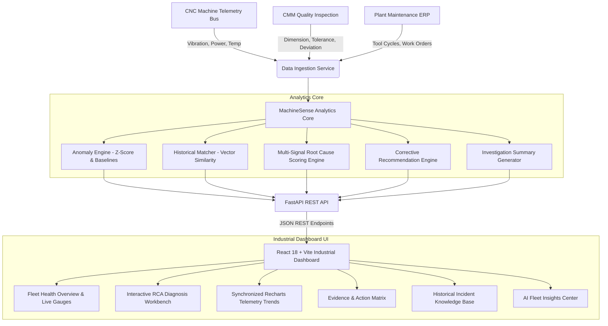

# MachineSense: AI-Assisted Industrial Root Cause Analysis & Diagnostic Intelligence

**MachineSense** is an evidence-driven, AI-assisted root cause analysis (RCA) platform built for precision manufacturing. When a machined component fails dimensional inspection, MachineSense instantly correlates CNC machine logs, process parameters, high-frequency telemetry, maintenance history, and historical failure cases to detect anomalies, rank probable root causes with mathematical confidence, identify similar past incidents, and recommend corrective and preventive actions.

---

## 🏭 The Problem in Manufacturing

In modern CNC precision machining facilities, when a component fails Coordinate Measuring Machine (CMM) dimensional inspection, quality and maintenance engineers are forced to manually parse disconnected systems:
- CNC controller telemetry (spindle speed, feed rate, G-code parameters)
- Machine condition sensors (spindle vibration, motor power draw, thermal expansion)
- Tool life logs (machining cycles, insert wear tracking)
- Maintenance ERP work orders (last scheduled tool replacement, calibration dates)
- Historical non-conformance reports (NCRs)

This fragmented workflow leads to **slow investigation times**, **repeated scrap production**, **inconsistent diagnosis across shifts**, and **reduced First Pass Yield (FPY)**.

---

## 💡 The MachineSense Solution: Evidence-Driven RCA

MachineSense does not generate generic guesses (such as *"possible causes are vibration or temperature"*). Instead, **MachineSense is 100% evidence-driven**:
1. **Multi-Signal Anomaly Detection**: Calculates statistical Z-scores and Isolation Forest baselines across spindle vibration, cutting power consumption, and thermal drift.
2. **Explainable Root Cause Scoring**: Combines anomaly severity, monotonic trend slopes, maintenance overdue flags, and historical case similarities into a normalized confidence percentage.
3. **Traceable Evidence Badges**: Backs every root cause with verifiable plant metrics (*e.g., Tool T-14 at 1,842 cycles vs. 1,500 limit, Spindle power +18.4% surge*).
4. **Vectorized Historical Similarity Matcher**: Compares failure signatures against 60+ past plant incidents using weighted multi-feature Euclidean distance / Cosine similarity.
5. **Action Matrix**: Categorizes immediate operational actions (*e.g., Tool replacement & optical offset recalibration*) and preventive engineering actions (*e.g., Tool wear threshold reduction & live vibration interlocks*).
6. **Executive Investigation Summary**: Generates physics-of-failure narratives deterministically offline (with optional LLM enhancement).

---

## 🏗 System Architecture



---

## 🛠 Tech Stack

### Backend
- **Framework**: Python 3.9+ / FastAPI / Uvicorn
- **Data & Analytics**: Pandas, NumPy, Scikit-learn
- **Validation**: Pydantic v2
- **Database**: SQLite with indexed relational tables (easily portable to PostgreSQL / Supabase)
- **Testing**: Pytest, HTTPX TestClient

### Frontend
- **Framework**: React 18 / Vite
- **Styling**: Tailwind CSS (Dark industrial navy palette with amber/emerald/cyan/rose accents)
- **Visualizations**: Recharts (Synchronized multi-series telemetry charts, reference tolerance lines, anomaly markers)
- **Icons**: Lucide React
- **Routing**: React Router v6

---

## 📂 Project Structure

```text
RootIQ/
├── backend/
│   ├── app/
│   │   ├── main.py                     # FastAPI application & lifespan management
│   │   ├── config.py                   # App configuration & CORS settings
│   │   ├── database.py                 # SQLite initialization & dataset loading
│   │   ├── models/                     # Database models
│   │   ├── schemas/
│   │   │   ├── investigation.py        # Pydantic RCA investigation schemas
│   │   │   ├── machine.py              # Machine telemetry & health schemas
│   │   │   └── dashboard.py            # Overview KPIs and insight schemas
│   │   ├── services/
│   │   │   ├── data_service.py         # Relational database & CSV querying
│   │   │   ├── anomaly_engine.py       # Multi-parameter anomaly detection
│   │   │   ├── historical_matcher.py   # Vectorized case similarity matching
│   │   │   ├── root_cause_engine.py    # Multi-signal mathematical scoring engine
│   │   │   ├── recommendation_engine.py# Immediate & preventive action matrix
│   │   │   └── summary_generator.py    # Deterministic / LLM narrative generator
│   │   └── api/
│   │       ├── health.py               # /health check
│   │       ├── dashboard.py            # /api/dashboard/overview
│   │       ├── machines.py             # /api/machines, /api/machines/{id}
│   │       ├── investigations.py      # /api/investigations, /api/investigations/analyze
│   │       ├── maintenance.py          # /api/maintenance overview & alerts
│   │       ├── historical_cases.py     # /api/historical-cases
│   │       └── insights.py             # /api/insights (fleet patterns)
│   ├── data/
│   │   ├── generate_data.py            # Synthetic dataset generator
│   │   ├── machine_logs.csv            # 700+ machine telemetry records
│   │   ├── inspection_results.csv      # 300+ CMM dimensional inspection records
│   │   ├── maintenance_history.csv     # 150+ maintenance and tool change records
│   │   ├── process_parameters.csv      # Process parameters per component
│   │   └── historical_cases.csv        # 60+ past failure cases with resolutions
│   ├── tests/
│   │   ├── test_health.py
│   │   ├── test_anomaly_engine.py
│   │   ├── test_root_cause_engine.py
│   │   └── test_investigations_api.py
│   ├── requirements.txt
│   └── .env.example
│
├── frontend/
│   ├── src/
│   │   ├── components/
│   │   │   ├── common/                 # Navbar, Sidebar, MetricCard, StatusBadge, LoadingOverlay
│   │   │   ├── dashboard/              # MachineHealthGrid, RecentInvestigationsTable, FleetInsightAlerts
│   │   │   ├── investigation/          # Header, RootCauseRankList, EvidencePanel, TrendCharts, ActionMatrix, Summary
│   │   │   └── machines/               # MachineTelemetryModal
│   │   ├── pages/
│   │   │   ├── DashboardPage.jsx       # Shop floor overview
│   │   │   ├── InvestigationsPage.jsx  # Interactive RCA workbench + demo launcher
│   │   │   ├── MachinesPage.jsx        # Fleet telemetry monitors
│   │   │   ├── MaintenancePage.jsx     # Tool cycle wear & overdue alerts
│   │   │   ├── HistoricalCasesPage.jsx # Searchable knowledge base
│   │   │   └── AIInsightsPage.jsx      # Fleet systemic pattern correlation
│   │   ├── services/
│   │   │   └── api.js                  # Axios client
│   │   ├── App.jsx                     # Router & layout
│   │   ├── index.css                   # Custom industrial styling
│   │   └── main.jsx
│   ├── package.json
│   ├── vite.config.js
│   └── tailwind.config.js
│
└── README.md
```

---

## 🔬 Mathematical Root Cause Scoring Formulation

MachineSense calculates candidate root cause confidence percentages using a multi-signal formulation:

$$\text{Score}(\text{Cause}) = w_1 S_{\text{anomaly}} + w_2 S_{\text{trend}} + w_3 S_{\text{maintenance}} + w_4 S_{\text{process}} + w_5 S_{\text{historical}}$$

For **Tool Wear**:
- $S_{\text{cycle}} = \max\left(0, \frac{\text{Cycles} - \text{MaxCycles}}{\text{MaxCycles}}\right)$
- $S_{\text{cutting\_force}} = \frac{\Delta \text{Power}}{\text{Baseline Power}}$
- $S_{\text{drift}} = \frac{|\text{Dimensional Deviation}|}{\text{Upper Tolerance Limit}}$
- $S_{\text{maintenance}} = 0.95 \text{ if Overdue else } 0.20$
- $S_{\text{historical}} = \sum_{\text{cases}} \text{Similarity}(\text{Case}_i) \cdot \mathbb{I}(\text{Cause}_i = \text{Tool Wear})$

Normalized into confidence percentages where the flagship scenario yields **Tool Wear (#1 Rank, ~87% Confidence)**, followed by **Excessive Vibration (#2 Rank, ~72% Confidence)** and **Incorrect Feed Rate (#3 Rank, ~46% Confidence)**.

---

## 🚀 Quickstart & Local Execution

### 1. Backend Setup

1. Open PowerShell or Terminal and navigate to `backend`:
   ```bash
   cd backend
   ```

2. Activate the Python virtual environment:
   ```powershell
   # Windows (PowerShell)
   .\venv\Scripts\Activate.ps1

   # Linux / macOS
   source venv/bin/activate
   ```

3. Install dependencies:
   ```bash
   pip install -r requirements.txt
   ```

4. Launch the FastAPI server:
   ```bash
   uvicorn app.main:app --reload --port 8000
   ```

5. Verify backend:
   - API Status: [http://127.0.0.1:8000/](http://127.0.0.1:8000/)
   - Health Check: [http://127.0.0.1:8000/health](http://127.0.0.1:8000/health)
   - Interactive Swagger Docs: [http://127.0.0.1:8000/docs](http://127.0.0.1:8000/docs)

---

### 2. Frontend Setup

1. Open a new Terminal and navigate to `frontend`:
   ```bash
   cd frontend
   ```

2. Install dependencies:
   ```bash
   npm install
   ```

3. Start the Vite development server:
   ```bash
   npm run dev
   ```

4. Open the MachineSense dashboard:
   - Application URL: [http://localhost:5173/](http://localhost:5173/)

---

## 🧪 Running Automated Backend Tests

To run the complete test suite verifying health endpoints, anomaly detection, root cause ranking, and API responses:

```bash
cd backend
.\venv\Scripts\pytest.exe tests -v
```

---

## 🎬 Hackathon Judging Demo Flow

1. **Dashboard Overview**:
   - Observe **94.2% First Pass Yield**, **8 CNC machines monitored**, and **Critical Anomaly alerts**.
   - Notice machine `CNC-07` in **Critical** health (42/100) due to tool cycle overage and vibration.
2. **Launch RCA Investigation**:
   - Click **"Launch Demo Investigation (CNC-2847)"** or navigate to **Investigations**.
   - Review pre-filled parameters: Component `CNC-2847`, Machine `CNC-07`, Failure `Dimensional Inspection Failure`.
   - Click **"Analyze Failure"**.
   - Observe the multi-stage scanning animation as the engine correlates telemetry streams.
3. **Examine Ranked Root Causes**:
   - **Tool Wear** is ranked **#1 with 87.4% High Confidence**.
   - **Excessive Vibration** is ranked **#2 with 72.1% Medium-High**.
4. **Inspect Evidence Panel**:
   - Click **Tool Wear** to view evidence badges:
     - **TOOL USAGE**: Tool `T-14` accumulated 1,842 cycles (exceeding 1,500 limit by +22.8%).
     - **ANOMALY**: Spindle power surge +18.4% (5.25 kW vs 4.20 kW baseline).
     - **TREND**: Monotonic dimensional drift across 35 consecutive components.
     - **MAINTENANCE**: Replacement Overdue (last replaced 21 days ago).
5. **Analyze Telemetry Trend Charts**:
   - Switch between **Dimensional Drift**, **Vibration**, **Power Draw**, and **Temperature**.
   - Note the failure point marker at component `CNC-2847`.
6. **Review Historical Matches**:
   - View Case `#CASE-104` (91.2% similarity on `CNC-07`) and Case `#CASE-088` (84.5% on `CNC-04`).
7. **Action Matrix & Executive Summary**:
   - View Immediate actions (*Replace Tool T-14, recalibrate optical offsets, quarantine preceding 15 parts*).
   - View Preventive actions (*Lower replacement threshold to 1,400 cycles, enable vibration interlock*).
   - Copy or print the formatted physics-of-failure investigation report.
8. **Explore Fleet Views**:
   - Explore **Machines** (telemetry modal), **Maintenance** (wear tracker), **Historical Cases** (knowledge base), and **AI Insights** (systemic pattern discoveries).

---

## 🔮 Future Scope & Roadmap

- **Live IoT MQTT / OPC-UA Connector**: Direct real-time streaming from Fanuc, Siemens Sinumerik, and Heidenhain CNC controllers.
- **Acoustic Emission Frequency FFT**: Ingestion of ultrasonic acoustic emission sensor data for micro-crack detection.
- **Automated ERP Work Order Creation**: Direct API integration with SAP PM / Maximo to auto-dispatch tool replacement work orders upon anomaly detection.
- **Closed-Loop CNC Offset Compensation**: Automatic G-code wear offset adjustments sent back to the CNC controller before tolerance breach.
